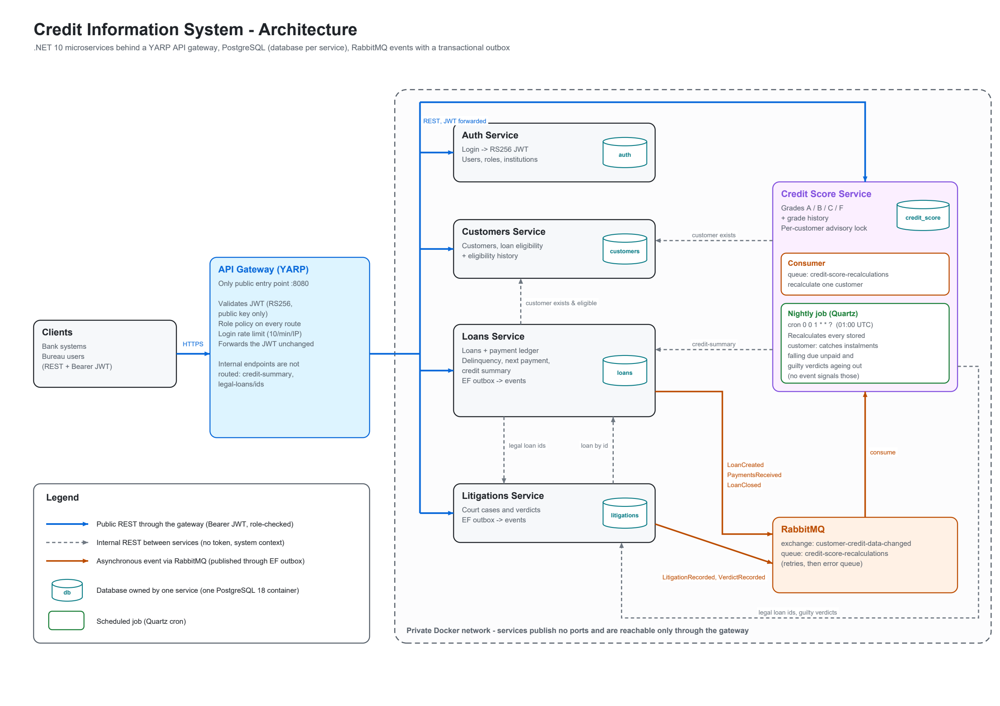

# Credit Information System

## Running

To run the system, just run this at the root folder:

```
docker compose up
```

If you don't like Docker (like me), you can always `dotnet run` each service. You'll need:

- PostgreSQL on port `5432`, user `cis`, password `cis_dev_password`, with the databases from `db/init/01-create-databases.sql` created
- RabbitMQ on port `5672`, user `cis`, password `cis_dev_password`

## API docs

Swagger UI for all services: http://localhost:8080/swagger (pick the service from the top-right dropdown).
Log in with `POST /api/auth/login`, then paste the `access_token` into **Authorize**.

## Architecture



Full diagram and design decisions: [docs/architecture.pdf](docs/architecture.pdf)
